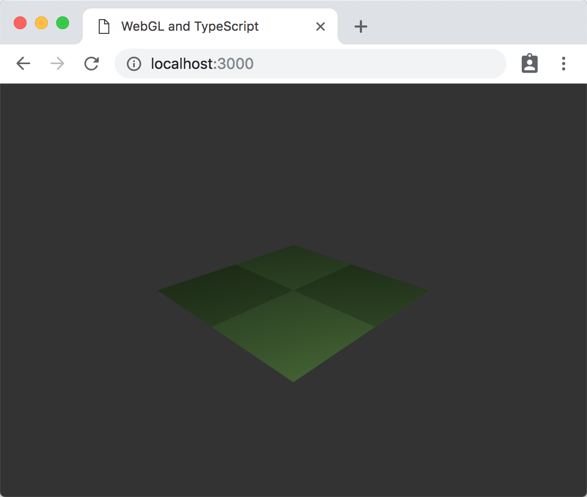

# WebGL and TypeScript

This project is a simple demo of how to use WebGL2 and TypeScript together. It demostrates the setup of a simple shader-based renderer, texture creation, and basic mouse integration.

In an effort to make this code more resilient to bit-rot, the version of TypeScript has been fixed at 3.2.2, and webpack has been fixed at 4.28.1.

## Usage

If you use yarn, getting up and running should be as simple as `yarn`.

You can then start the dev server using `yarn start`.

## Screenshot

If everything is working correctly, you should see something like this:

Scrolling using your mousewheel or touchpad should zoom in and out. Holding down the left mouse button and moving the mouse left or right should rotate the plane around the Y axis (the axis around the normal of the plane).

## Resources

This project as a whole is based on [WebGL-Typescript-Starter](https://github.com/NikitaIT/WebGL-Typescript-Starter). A lot of code was removed to make it easier to adapt to other projects. This includes code for testing, since testing frameworks and practices change so rapidly in the JavaScript ecosystem.

The simple renderer in this code is based on examples [WebGL2 Fundamentals](https://webgl2fundamentals.org). This site has been useful as a reference, and a source of utility functions.

It also relies heavily on [TWGL](http://twgljs.org/) (A Tiny WebGL helper Library), which makes code using the WebGL API less verbose.

## TODO

The code is still a bit messy, so that is likely to evolve over time.

My intention is to add a few features that will be useful to most projects, including more advanced mouse integration (e.g. object picking).

I would also like to experiment with React integration, with a view towards using this as a starting point for WebGL-based visualisation tools.

## License

This code is licensed under the ISC License.

See the LICENSE file for more information.
